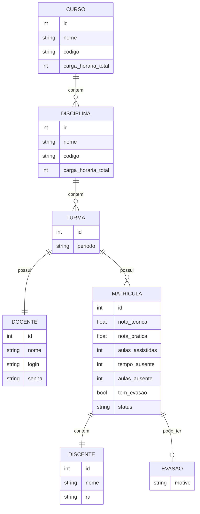

# DiagEPT_LP - Sistema de Diagnóstico de Turmas EPT

Este é o primeiro projeto da disciplina de **Laboratório de Programação**, desenvolvido em linguagem **C**.

O objetivo é criar um sistema interativo para análise e diagnóstico de turmas da **Educação Profissional e Tecnológica (EPT)**, permitindo a organização de dados acadêmicos e avaliação de desempenho.

---

## 📌 Objetivo do Projeto

Desenvolver um programa que simule um sistema de gerenciamento contínuo através de um menu interativo, aplicando conceitos como:

- Estruturas de decisão
- Laços de repetição
- Validação de dados

---

## Diagrama de relacionamento entre entidades(structs)


## ⚙️ Compilação

Para compilar o projeto, utilize o seguinte comando:

```bash
    gcc src/*.c src/*/*.c lib/cjson/cJSON.c -Iinclude -Iinclude/cjson -o bin/programa
    gcc (Get-ChildItem src/.c, src//*.c, lib/cjson/cJSON.c) -Iinclude -Iinclude/cjson -o bin/programa.exe
```
# 🚀 GUIA DE COMANDOS GIT - PROJETO 1 (LAB. PROGRAMAÇÃO)
Equipe: 7 Integrantes | IDE: VS Code | Workflow: GitHub

---

### 📥 1. PREPARANDO O AMBIENTE (O Início)
> Use estes comandos para baixar o projeto ou atualizar sua base.

git clone [URL]          # Baixa o repositório do GitHub para sua máquina.
git remote -v            # Verifica se o link do GitHub está configurado corretamente.
git pull origin main     # Traz as últimas atualizações da 'main' para o seu PC.

---

### 🌿 2. TRABALHANDO NA SUA TASK (Branching)
> Regra de Ouro: Nunca trabalhe direto na 'main'. Crie uma branch para sua tarefa.

git checkout -b [nome]   # Cria uma nova "ramificação" para sua task e entra nela.
git checkout [nome]      # Alterna entre branches que já existem.
git branch               # Lista todas as suas branches locais.
git branch -d [nome]     # Deleta uma branch (use após finalizar e subir a task).

---

### 💾 3. SALVANDO O PROGRESSO (Commit & Push)
> O ciclo diário de todo programador.

git status               # Mostra quais arquivos você alterou e se estão prontos.
git add .                # Prepara TODOS os arquivos alterados para o salvamento.
git add [arquivo]        # Prepara apenas um arquivo específico.
git commit -m "texto"    # Salva as alterações com uma mensagem descritiva.
git push origin [nome]   # Envia sua branch/task para o GitHub.

---

### 🔄 4. INTEGRAÇÃO E SEGURANÇA
> Comandos para unir o trabalho e evitar perda de código.

git fetch                # Verifica se há novidades no servidor sem baixar nada.
git merge [nome]         # Une o código da branch [nome] à branch que você está.
git log --oneline        # Mostra um histórico simplificado de quem fez o quê.
git checkout .           # DESCARTA todas as alterações não salvas (CUIDADO!).
git stash                # "Esconde" mudanças temporárias para trocar de branch rápido.
git stash pop            # Recupera as mudanças que você "escondeu" com o stash.

---

### 🛠️ DICAS PARA VS CODE (Interface Visual)
1. CTRL + J (Terminal): Onde você digita os comandos acima.
2. Ícone de "Três Círculos" (Lateral): Interface gráfica do Git.
   - Botão + : Equivale ao 'git add'.
   - Check (✔️): Equivale ao 'commit'.
   - Sincronizar (🔄): Faz o 'push' e 'pull' automaticamente.

