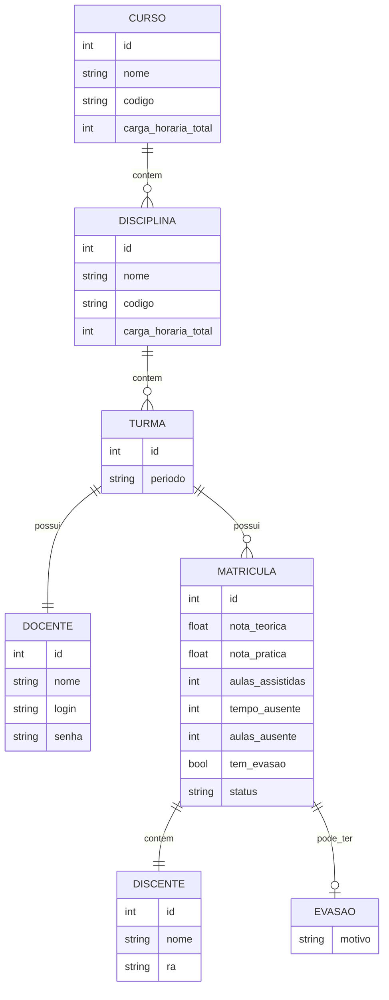

# DiagEPT_LP - Sistema de Diagnóstico de Turmas EPT

Este é o primeiro projeto da disciplina de **Laboratório de Programação**, desenvolvido em linguagem **C**.

O objetivo é criar um sistema interativo para análise e diagnóstico de turmas da **Educação Profissional e Tecnológica (EPT)**, permitindo a organização de dados acadêmicos e avaliação de desempenho.

---

## 📌 Objetivo do Projeto

Desenvolver um programa que simule um sistema de gerenciamento contínuo através de um menu interativo, aplicando conceitos como:

- Estruturas de decisão
- Laços de repetição
- Validação de dados

---

## Diagrama de relacionamento entre entidades(structs)


## ⚙️ Compilação

Para compilar o projeto, utilize o seguinte comando:

```bash
    gcc src/*.c src/*/*.c lib/cjson/cJSON.c -Iinclude -Iinclude/cjson -o bin/programa
    gcc (Get-ChildItem src/.c, src//*.c, lib/cjson/cJSON.c) -Iinclude -Iinclude/cjson -o bin/programa.exe
```
