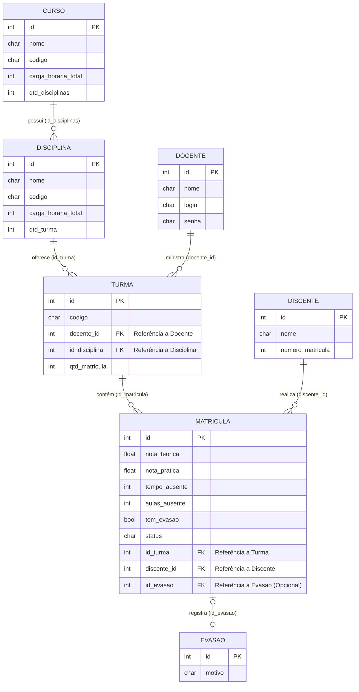

# DiagEPT_LP - Sistema de Diagnóstico de Turmas EPT

Este é o primeiro projeto da disciplina de **Laboratório de Programação**, desenvolvido em linguagem **C**.

O objetivo é criar um sistema interativo para análise e diagnóstico de turmas da **Educação Profissional e Tecnológica (EPT)**, permitindo a organização de dados acadêmicos e avaliação de desempenho.

---

## 📌 Objetivo do Projeto

Desenvolver um programa que simule um sistema de gerenciamento contínuo através de um menu interativo, aplicando conceitos como:

- Estruturas de decisão
- Laços de repetição
- Validação de dados

---


##  Arquitetura
A arquitetura do sistema fundamenta-se na separação estrita de responsabilidades nas seguintes camadas:

*   **Model (`model/`):** Define as estruturas de dados fundamentais (Entidades) do domínio do problema, tais como `Curso`, `Disciplina`, `Turma`, `Discente`, `Docente`, `Matricula` e `Evasao`.
*   **DAO (`dao/`):** Abstrai e encapsula os mecanismos de acesso a dados. Garante que as camadas superiores operem sobre os dados sem necessitar de conhecimento prévio sobre o mecanismo de persistência subjacente.
*   **JSON Mapper (`json_mapper/`):** Atua como a camada de serialização e desserialização. Faz a interface entre as estruturas em memória (C `structs`) e o armazenamento em texto plano formatado (JSON).
*   **Controller (`controller/`):** Orquestra o fluxo de dados entre as camadas *View* e *DAO*. Contém as regras de negócio intrínsecas ao sistema, tais como validações de integridade referencial (e.g., `excluir_curso_seguro`, que impede a deleção de cursos com disciplinas vinculadas).
*   **View (`view/`):** Responsável pela interação com o usuário final (I/O). Encarrega-se da coleta de *inputs* padronizados e da apresentação visual dos dados, desprovida de regras de negócio.
*   **Utils (`utils/`):** Provê funções genéricas de suporte, como tratamento de *strings*, manipulação segura de memória e leitura/escrita de arquivos brutos.


## Estrutura de pastas

A organização do repositório reflete a arquitetura supracitada:

```
DiagEPT_LP/
├── bin/            # Binários compilados e artefatos de execução
├── data/           # Repositório de dados persistentes (*.json)
├── _docs/          # Documentação técnica e diagramas (e.g., Mermaid)
├── include/        # Arquivos de cabeçalho (.h) das declarações de interface
│   ├── cjson/
│   ├── controller/
│   ├── dao/
│   ├── json_mapper/
│   ├── model/
│   ├── utils/
│   └── view/
├── lib/            # Bibliotecas de terceiros estaticamente integradas
│   └── cjson/      # Biblioteca cJSON (v1.7.19) para manipulação de JSON em C
├── src/            # Código-fonte (.c) contendo as implementações
│   ├── controller/
│   ├── dao/
│   ├── json_mapper/
│   ├── model/
│   ├── utils/
│   ├── view/
│   └── main.c      # Ponto de entrada do programa (Entry point)
├── LICENSE         # Termos de licenciamento do software
└── README.md       # Este documento
```

## Diagrama de relacionamento entre entidades(structs)


## ⚙️ Compilação

Para compilar o projeto, utilize o seguinte comando:

- Linux
```bash
    gcc src/*.c src/*/*.c lib/cjson/cJSON.c -Iinclude -Iinclude/cjson -o bin/programa
```
- Windows
```powershell
    gcc (Get-ChildItem src/.c, src//*.c, lib/cjson/cJSON.c) -Iinclude -Iinclude/cjson -o bin/programa.exe