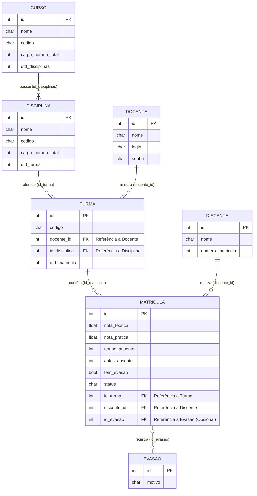

# DiagEPT_LP - Sistema de Diagnóstico de Turmas EPT

Este é o primeiro projeto da disciplina de **Laboratório de Programação**, desenvolvido em linguagem **C**.

O objetivo é criar um sistema interativo para análise e diagnóstico de turmas da **Educação Profissional e Tecnológica (EPT)**, permitindo a organização de dados acadêmicos e avaliação de desempenho.

---

## 📌 Objetivo do Projeto

Desenvolver um programa que simule um sistema de gerenciamento contínuo através de um menu interativo, aplicando conceitos como:

- Estruturas de decisão
- Laços de repetição
- Validação de dados

---


##  Arquitetura
A arquitetura do sistema fundamenta-se na separação estrita de responsabilidades nas seguintes camadas:

*   **Model (`model/`):** Define as estruturas de dados fundamentais (Entidades) do domínio do problema, tais como `Curso`, `Disciplina`, `Turma`, `Discente`, `Docente`, `Matricula` e `Evasao`.
*   **DAO (`dao/`):** Abstrai e encapsula os mecanismos de acesso a dados. Garante que as camadas superiores operem sobre os dados sem necessitar de conhecimento prévio sobre o mecanismo de persistência subjacente.
*   **JSON Mapper (`json_mapper/`):** Atua como a camada de serialização e desserialização. Faz a interface entre as estruturas em memória (C `structs`) e o armazenamento em texto plano formatado (JSON).
*   **Controller (`controller/`):** Orquestra o fluxo de dados entre as camadas *View* e *DAO*. Contém as regras de negócio intrínsecas ao sistema, tais como validações de integridade referencial (e.g., `excluir_curso_seguro`, que impede a deleção de cursos com disciplinas vinculadas).
*   **View (`view/`):** Responsável pela interação com o usuário final (I/O). Encarrega-se da coleta de *inputs* padronizados e da apresentação visual dos dados, desprovida de regras de negócio.
*   **Utils (`utils/`):** Provê funções genéricas de suporte, como tratamento de *strings*, manipulação segura de memória e leitura/escrita de arquivos brutos.

## 📚 Bibliotecas de Terceiros

O projeto utiliza a biblioteca **cJSON** (versão 1.7.19), desenvolvida por Dave Gamble e disponível no repositório GitHub [davegamble/cjson](https://github.com/davegamble/cjson). Esta biblioteca é uma implementação leve e eficiente para manipulação de dados no formato JSON (JavaScript Object Notation) em linguagem C, sem dependências externas além da biblioteca padrão C.

### Utilização no Projeto
A biblioteca cJSON é empregada na camada de **JSON Mapper** para realizar a serialização e desserialização de estruturas de dados (structs) em C para o formato JSON, facilitando a persistência de dados em arquivos texto plano. Especificamente:

- **Serialização:** Converte objetos C (como instâncias de `Curso`, `Discente`, `Turma`, etc.) em strings JSON para armazenamento em arquivos na pasta `data/`.
- **Desserialização:** Interpreta arquivos JSON existentes e reconstrói as estruturas de dados em memória, permitindo a recuperação de estados anteriores do sistema.
- **Integração:** A biblioteca é integrada estaticamente ao projeto, sendo compilada junto com o código-fonte principal, garantindo portabilidade e ausência de dependências dinâmicas em tempo de execução.

Essa abordagem permite uma separação clara entre a lógica de negócio e o mecanismo de persistência, seguindo princípios de arquitetura em camadas e facilitando a manutenção e escalabilidade do sistema.

## Estrutura de pastas

A organização do repositório reflete a arquitetura supracitada:

```
DiagEPT_LP/
├── bin/            # Binários compilados e artefatos de execução
├── data/           # Repositório de dados persistentes (*.json)
├── _docs/          # Documentação técnica e diagramas (e.g., Mermaid)
├── include/        # Arquivos de cabeçalho (.h) das declarações de interface
│   ├── cjson/
│   ├── controller/
│   ├── dao/
│   ├── json_mapper/
│   ├── model/
│   ├── utils/
│   └── view/
├── lib/            # Bibliotecas de terceiros estaticamente integradas
│   └── cjson/      # Biblioteca cJSON (v1.7.19) para manipulação de JSON em C
├── src/            # Código-fonte (.c) contendo as implementações
│   ├── controller/
│   ├── dao/
│   ├── json_mapper/
│   ├── model/
│   ├── utils/
│   ├── view/
│   └── main.c      # Ponto de entrada do programa (Entry point)
├── LICENSE         # Termos de licenciamento do software
└── README.md       # Este documento
```

## Diagrama de relacionamento entre entidades(structs)


## ⚙️ Compilação

Para compilar o projeto, utilize o seguinte comando:

- Linux
```bash
    gcc src/*.c src/*/*.c lib/cjson/cJSON.c -Iinclude -Iinclude/cjson -o bin/programa
```
- Windows
```powershell
    gcc (Get-ChildItem src/.c, src//*.c, lib/cjson/cJSON.c) -Iinclude -Iinclude/cjson -o bin/programa.exe

```


---

## 🚀 Como Usar o Sistema

### Menu Principal

Após compilar e executar o programa, o sistema apresenta um menu principal com as seguintes opções:

1. **Gestão de Cursos**
2. **Gestão de Disciplinas**
3. **Gestão de Turmas e Matrículas**
4. **Gestão de Discentes**
5. **Lançamento de Notas**
6. **Relatórios e Diagnósticos**
7. **Registro de Evasões**
8. **Sair**

O sistema requer autenticação de docente no início. Digite o login e senha válidos para acessar o menu.

### Fluxos de Funcionalidades

#### Adicionar Notas (Opção 5 > 1)
Este fluxo permite lançar notas para alunos em uma turma específica.

**Sequência de comandos:**
1. No menu principal, digite `5` para "Lançamento de Notas".
2. Digite `1` para "Gerenciar notas".
3. O sistema solicitará o ID da turma para a qual deseja lançar notas.
4. Digite o ID da turma (deve ser um número inteiro válido).
5. O sistema exibirá os alunos matriculados na turma.
6. Para cada aluno, o sistema solicitará:
   - Nota de conhecimentos teóricos (0.0 a 10.0)
   - Nota de habilidades práticas (0.0 a 10.0)
   - Total de aulas assistidas (número inteiro)
7. Após inserir as notas para todos os alunos, o sistema salvará automaticamente.

**Validações:**
- Notas devem estar entre 0.0 e 10.0 (não negativas).
- Uma aula equivale a 45 minutos (essa informação é usada internamente para cálculos).
- Se uma opção inválida for digitada, o sistema solicita entrada correta.

#### Visualizar Diagnóstico (Opção 6 > 1)
Este fluxo mostra estatísticas e diagnósticos da turma em tempo real.

**Sequência de comandos:**
1. No menu principal, digite `6` para "Relatórios e Diagnósticos".
2. Digite `1` para "Dashboard da turma, ranking de alunos e estatísticas".
3. Digite o ID da turma para visualizar o diagnóstico.
4. O sistema exibirá:
   - Quantidade de alunos na turma
   - Notas teóricas e práticas (médias, etc.)
   - Se a turma tem alto grau de defasagem
   - Aluno com maior nota
   - Aluno com menor nota
   - Outras estatísticas processadas até o momento

#### Registrar Evasão (Opção 7 > 1)
Este fluxo registra alunos que estão evadindo, solicitando o motivo.

**Sequência de comandos:**
1. No menu principal, digite `7` para "Registro de Evasões".
2. Digite `1` para "Captura de motivos e atualização de status".
3. Siga as instruções na tela para registrar a evasão, incluindo o motivo.

#### Encerrar Programa (Opção 8)
**Sequência de comandos:**
1. No menu principal, digite `8` para "Sair".
2. O sistema exibirá uma mensagem de agradecimento e encerrará.

### Outros Fluxos Disponíveis

#### Gestão de Cursos (Opção 1)
- **Registrar curso:** Digite `1` > `1`, preencha os dados do curso.
- **Remover curso:** Digite `1` > `2`, digite o ID do curso a remover.
- **Listar cursos:** Digite `1` > `3`, visualiza todos os cursos cadastrados.
- **Sair:** Digite `1` > `4`.

#### Gestão de Disciplinas (Opção 2)
- **Registrar disciplina:** Digite `2` > `1`, preencha os dados da disciplina (com validação de carga horária e códigos únicos).
- **Remover disciplina:** Digite `2` > `2`, digite o ID da disciplina.
- **Listar disciplinas:** Digite `2` > `3`, visualiza todas as disciplinas.
- **Sair:** Digite `2` > `4`.

#### Gestão de Turmas e Matrículas (Opção 3)
- **Criar turmas:** Digite `3` > `1`, siga o fluxo para criar uma nova turma.
- **Menu turmas:** Digite `3` > `2`, acessa submenu para gerenciar turmas específicas (listagem, busca de discentes, controle de matrículas).
- **Sair:** Digite `3` > `3`.

#### Gestão de Discentes (Opção 4)
- **Registrar aluno:** Digite `4` > `1`, preencha os dados do aluno.
- **Remover aluno:** Digite `4` > `2`, digite o ID do aluno.
- **Listar discentes:** Digite `4` > `3`, visualiza todos os discentes.
- **Sair:** Digite `4` > `4`.

#### Registro de Evasões - Listar (Opção 7 > 2)
- **Listar todas as evasões:** Digite `7` > `2`, visualiza relatório de todas as evasões registradas.
- **Sair:** Digite `7` > `3`.

### Validações Gerais
- **Opções inválidas:** Se o usuário digitar uma opção não listada, o sistema exibirá "Opção inválida!" e solicitará uma entrada correta.
- **Notas:** Sempre entre 0.0 e 10.0, sem valores negativos.
- **Aulas:** Cada aula equivale a 45 minutos para cálculos internos.

### Gerenciamento de Estado
O sistema mantém e exibe em tempo real:
- Quantidade de alunos por turma
- Notas teóricas e práticas (individuais e médias)
- Indicador de alto grau de defasagem na turma
- Aluno com a maior nota
- Aluno com a menor nota

---

<h2 id="colab">🤝 Colaboradores</h2>

Desenvolvedores do projeto

<table>
  <tr>
    <td align="center">
      <a href="https://github.com/JVKW">
        <br>
        <sub>
          <b>João Victor</b>
        </sub>
      </a>
    </td>
    <td align="center">
      <a href="https://github.com/nclsmajor">
        <br>
        <sub>
          <b>Nícolas Bessa</b>
        </sub>
      </a>
    </td>
    </td>
    <td align="center">
      <a href="https://github.com/jlucascode">
        <br>
        <sub>João Lucas</b>
        </sub>
      </a>
    </td>
    </td>
    <td align="center">
      <a href="https://github.com/Jeffersonoryp">
        <br>
        <sub>Jefferson Carvalho</b>
        </sub>
      </a>
    </td>
    </td>
    <td align="center">
      <a href="https://github.com/lucastonnyx">
        <br>
        <sub>Lucas Tonny</b>
        </sub>
      </a>
    </td>
    </td>
    <td align="center">
      <a href="https://github.com/Pedro-net32">
        <br>
        <sub>Pedro Henrique</b>
        </sub>
      </a>
    </td>
    <td align="center">
      <a href="https://github.com/XandersonSilva">
        <br>
        <sub>
          <b>Xanderson Silva</b>
        </sub>
      </a>
    </td>
  </tr>
</table>
